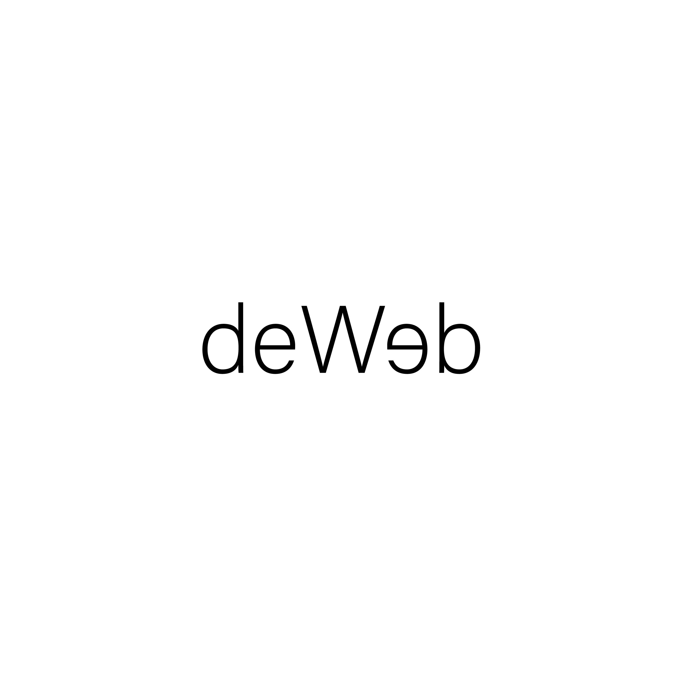
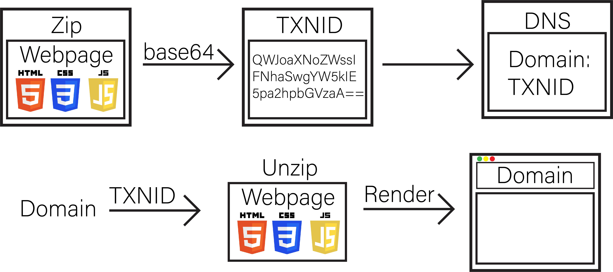

# deWeb

Created for the Devfest 2023 Hackathon
Team: Abhishek Chaudhary, Sai Chintalapati, Nikhilesh Belulkar, & Divjot Bedi

### 1. Use `create_dns_app.py` to create the main DNS smart contract (akin to a nameserver)
### 2. Use `add_dns_entry.py` with the ID of the DNS contract created in (1) to add website files in a blockchain transaction and add DNS record pointing to it
### 3. Use `browser.py` to access the website with the domain name selected in (2)



## Inspiration
Hosting websites on the blockchain offers several potential benefits over using cloud service providers which interact with centralized name servers.
1. Decentralization: One of the primary benefits of hosting websites on the blockchain is decentralization. Traditional web hosting services rely on centralized servers and infrastructure which try to replicate the distributed blockchain system with redundant servers and servers located closer to the user base but fail to approach the scale of using a blockchain.
2. Transparency: Blockchain-based hosting services can offer greater transparency than traditional web hosting services. Since blockchain is a distributed ledger, all transactions and changes to the website are recorded and stored on the blockchain, providing an auditable and transparent record of all activities related to the website. Websites such as [archive.org](https://archive.org/) replicate the historical records of websites but require users to save a snapshot of a website's contents preemptively. 
3. Content distribution: Blockchain-based hosting services can offer greater flexibility in terms of content distribution. Since the blockchain is a distributed network, content can be distributed across the network, making it easier to share content with users in different geographic locations.
Our goal was to move the system over to the blockchain and make a fully functional web browser interface that uses distributed DNS and delivers immutable websites to the end user. This would solve some of the issues associated with centralization by leveraging the blockchain's benefits.

Implementing DNS on the blockchain has the potential to address some of the potential drawbacks associated with traditional DNS systems.
1. Single point of failure: Blockchain-based DNS systems use a decentralized approach to store DNS records, meaning that there is no single point of failure. DNS records are stored on a distributed ledger, which is replicated across many nodes in the network. This distributed approach means that even if some nodes go down or are hacked, the DNS records remain available on other nodes, ensuring that the DNS system remains operational.
2. Latency: Blockchain-based DNS systems use a distributed network of nodes to store DNS records, which can reduce latency by allowing users to access the closest node in the network. Additionally, blockchain-based DNS systems use a consensus mechanism to ensure that DNS records are updated across the network, which can reduce the time it takes to update DNS records.
3. Security: Blockchain-based DNS systems can be more secure due to the use of cryptographic algorithms and distributed consensus mechanisms in contrast to traditional DNS systems are vulnerable to various types of attacks, including DNS spoofing, cache poisoning, and DDoS attacks.. The use of cryptographic algorithms can ensure that DNS records are tamper-proof, while the distributed consensus mechanism ensures that DNS records are updated across the network in a secure and transparent manner.

## What it does
The deWeb hack provides a unique and innovative solution to the problem of website hosting and web surfing. By leveraging blockchain technology, the team has created a system that allows for a fully decentralized web browsing experience, with all website components stored on the Algorand Blockchain. The hack provides a workflow for website owners to put all components of their website on a transaction on the blockchain, and access specific transaction blocks through a DNS also hosted on the blockchain in the form of a smart contract. This ensures that the website data is stored in a tamper-proof and secure manner, with no risk of data breaches or hacks.

## How we built it
Leveraging Python, algosdk, Pyteal, Beaker, and base64 we created a workflow for seamless back-and-forth between the Algorand Blockchain. We used `.zip` files for compression and `base64` encode to add website code onto individual transactions (`TXNID`). The `TXNID` was associated with a specific domain name in a DNS smart contract for future lookup. When a user provided a domain, the DNS contract was used to retrieve the `TXNID`.



The team began by developing a Python-based application that could interact with the Algorand Blockchain using the algosdk library. This allowed for seamless back-and-forth communication between the blockchain and the application, enabling the team to develop a powerful and user-friendly workflow for website hosting.

To add website code onto individual transactions on the blockchain, the team used `.zip` files for compression and `base64` encoding. This allowed for efficient and secure transfer of website data onto the blockchain, with no risk of data corruption or loss.

Each transaction on the blockchain was associated with a specific domain name in a DNS smart contract, enabling future lookup and retrieval of website data. When a user provided a domain name, the DNS contract was used to retrieve the corresponding `TXNID`, which could then be used to access the website data stored on the blockchain.

The team also used Pyteal, a smart contract language for Algorand, to develop a powerful and secure DNS smart contract. This contract enabled seamless and efficient lookup of website data on the blockchain, providing a powerful and user-friendly system for website hosting and web browsing.

More specifically, the DNS aspect worked by generating a smart signature contract account (logicSig) deterministically for each input name, which then initially opts into the main, single DNS store smart contract storing the associated transaction ID in its local storage. Then, any clients also generate the same smart signature contract account on browsing to the domain name, and its local storage can be accessed to determine what corresponding transaction ID value it added to the DNS store smart contract, since it is stateless.

Finally, the team used Beaker, an open-source library for building blockchain-based applications, to provide a robust and secure framework for the deWeb hack. Beaker allowed for seamless integration with the Algorand Blockchain, providing a powerful and flexible platform for website hosting and web browsing which suited the needs of the hack.

## Challenges we ran into
- We had to determine the best workflow for website data processing: either sending up the files or zipping them. We ended up deciding on zipping them for space efficiency.
- During the creation of smart contracts on the algorand net, the approval program for the transaction
```
create = Seq(App.box_create(...), Approve())
```
was causing the transaction to fail to create. After hopping on a call with Nullun from Algorand, we were able to debug that the transaction required a `boxes` parameter with a list of boxes with self referencing `0` as the app Id the box ref is for the application being called.
- We needed to query an application's local state but were unable to find a solution. Through Barnji from Algorand's help, we were able to use the [documentation](https://developer.algorand.org/docs/rest-apis/algod/v2/#get-v2accountsaddress) to solve this and use the application's associated information.

## Accomplishments that we're proud of
One of the main accomplishments we're proud of is that the hack we developed has real world applications outside of the hacking space. The creation of a DNS on the blockchain is a significant achievement as it provides a decentralized system for managing domain names. The team's successful storage of compressed websites in transactions on the blockchain demonstrates the potential for blockchain technology to be used as a secure and decentralized way to store data.

We are also proud of ramping up on smart contracts in a very short time period, being able to build a system that uses deterministically generated smart signature contracts (logicSig) and opts them to a central DNS smart contract to store data in its local storage. This creates a hashmap-like value store.

## What we learned
During the hackathon, the team members had the opportunity to apply their knowledge and skills to a real-world problem using blockchain technology. This experience helped them to gain a deeper understanding of the potential of blockchain and the challenges that come with working in a decentralized system.

Working with blockchain technology required the team members to think in a different way. They had to consider issues such as security, privacy, and consensus in a decentralized system. The team also had to learn how to write smart contracts and interact with blockchain networks, which required them to use new tools and technologies.

The hackathon also provided the team members with an opportunity to learn from their peers and industry experts. They had the chance to attend workshops and presentations, which gave them insights into the latest trends and best practices in blockchain technology.

## What's next for deWeb
Next step for deWeb could be to explore the implementation of backend databases associated with the websites being put on the blockchain. This would involve creating a database that is stored on the blockchain alongside the website data. The database could contain additional information about the website, such as user data, analytics, and other metrics.

In addition, the team could explore the potential for deWeb to be used as a platform for decentralized web hosting, providing a secure and decentralized way for individuals and businesses to host websites.